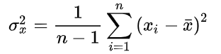
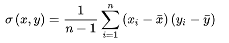
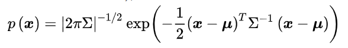

什么是协方差矩阵？可以认为是两部分，一部分是方差，另一部分是协方差，方差构成了对角线上的元素，协方差构成了非对角线上的元素

如何学习协方差矩阵？应该从几何角度去学习

学习协方差的几个结点？一个是方差和协方差的定义，以个是从方差或者协方差到协方差矩阵，一个是多元正态分布与线性变换，一个是协方差矩阵的特征值分解。四个角度

什么是方差？是用来度量单个随机变量的离散程度，公式为：

什么是协方差？用来刻画两个随机变量的相似程度，协方差的计算公式为：

在公式中，符号  分别表示两个随机变量所对应的观测样本均值，据此，我们发现：方差可视作随机变量 x 关于其自身的协方差  .

如何从方差/协方差到协方差矩阵呢？当前如果给d个随机变量，那么可以求到这些随机变量的方差，对这些方便，也可以求到两两之间的协方差，则当前可以得到一个矩阵，对角线为各个随机变量的方差，非对角线是两两随机变量的协方差，则该对阵为对称矩阵

什么是多元正态分布？假设一个向量x服从均值向量μ，协方差矩阵为的多元正态分布，则有公式：
此时将均值向量设为μ=0，即可将多元正态分布进行简化，再令 则得到协方差矩阵：

参考： https://zhuanlan.zhihu.com/p/37609917