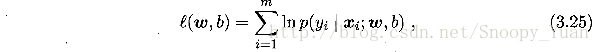
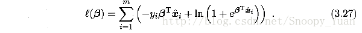

目标：编程实现对率回归，并给出西瓜数据3.0α上的结果

自己编程实现逻辑斯蒂回归
编程实现逻辑回归的主要工作是求取参数w和b（见书p59），最常用的参数估计方法是极大似然法，由于题3.1已经证得对数似然函数（见书3.27）是凸函数，存在最优解，这里考虑采用梯度下降法来迭代寻优。
回顾一下Sigmoid函数，即逻辑斯蒂回归分类器的基础模型：

目的是基于数据集求出最优参数w和b，最常采用的是极大似然法，参数的似然函数为：

根据书p59，最大化上式等价于最小化下式：

题3.2已证上式为凸函数，一定存在最小值，但按照导数为零的解析求解方式较为困难，于是考虑采用梯度下降法来求解上式最小值时对应的参数。
注：梯度下降法基本知识可参考书中附录p409页，也可直接采用书中p60式3.30偏导数公式。书中关于参数迭代改变式子如下：

对于迭代，可每次先根据(B.16)计算出梯度▽f(β)，然后由(B.17)更新得出下一步的Δβ。
接下来编程实现基本的梯度下降法：
(1)首先编程实现对象式3.27：
def likelihood_sub(x, y, beta):
    '''
    @param x: one sample variables
    @param y: one sample label
    @param beta: the parameter vector in 3.27
    @return: the sub_log-likelihood of 3.27  
    ''' 
    return -y * np.dot(beta, x.T) + np.math.log(1 + np.math.exp(np.dot(beta, x.T)))   

def likelihood(X, y, beta):
    '''
    @param X: the sample variables matrix
    @param y: the sample label matrix
    @param beta: the parameter vector in 3.27
    @return: the log-likelihood of 3.27  
    '''
    sum = 0
    m,n = np.shape(X)  

    for i in range(m):
        sum += likelihood_sub(X[i], y[i], beta)

    return sum  
(2)然后基于训练集（注意x->[x,1]），给出基于3.27似然函数的定步长梯度下降法，注意这里的偏梯度实现技巧：
'''
@param X: X is the variable matrix 
@param y: y is the label array
@return: the best parameter estimate of 3.27
'''
def gradDscent_1(X, y):  #implementation of basic gradDscent algorithms

    h = 0.1  # step length of iteration
    max_times= 500  # give the iterative times limit
    m, n = np.shape(X)

    beta = np.zeros(n)  # parameter and initial to 0
    delta_beta = np.ones(n)*h  # delta parameter and initial to h
    llh = 0
    llh_temp = 0

    for i in range(max_times):
        beta_temp = beta.copy()

        # for partial derivative 
        for j in range(n): 
            beta[j] += delta_beta[j]
            llh_tmp = likelihood(X, y, beta)
            delta_beta[j] = -h * (llh_tmp - llh) / delta_beta[j]                
            beta[j] = beta_temp[j]

        beta += delta_beta            
        llh = likelihood(X, y, beta)

    return beta
通过追踪参数，查看其收敛曲线，然后来调节相关参数（步长h，迭代次数max_times）。下图是在当前参数取值下的beta曲线，可以看到其收敛良好：

(3)最后建立Sigmoid预测函数，对测试集数据进预测，得到混淆矩阵如下：
[[ 4.  1.]
 [ 1.  3.]]
可以看出其总体预测精度（7/9 ≈ 0.78）与调用sklearn库得出的结果相当。
(4)采用随机梯度下降法来优化：上面采用的是全局定步长梯度下降法（称之为批量梯度下降），这种方法在可能会面临收敛过慢和收敛曲线波动情况的同时，每次迭代需要全局计算，计算量随数据量增大而急剧增大。所以尝试采用随机梯度下降来改善参数迭代寻优过程。
随机梯度下降法的核心思想是增量学习：一次只用一个新样本来更新回归系数，从而形成在线流式处理。
同时为了加快收敛，采用变步长的策略，h随着迭代次数逐渐减小。
给出变步长随机梯度下降法的代码如下：
def gradDscent_2(X, y):  #implementation of stochastic gradDscent algorithms
  '''
   @param X: X is the variable matrix 
   @param y: y is the label array
   @return: the best parameter estimate of 3.27
   '''
   import matplotlib.pyplot as plt  

   m, n = np.shape(X)
   h = 0.5  #  step length of iterator and initial
   beta = np.zeros(n)  # parameter and initial
   delta_beta = np.ones(n) * h
   llh = 0
   llh_temp = 0

   for i in range(m):
       beta_temp = beta.copy()  # for partial derivative 

       for j in range(n): 
           h = 0.5 * 1 / (1 + i + j)  # change step length of iterator 
           beta[j] += delta_beta[j]
           llh_tmp = likelihood_sub(X[i], y[i], beta)
           delta_beta[j] = -h * (llh_tmp - llh) / delta_beta[j]   
           beta[j] = beta_temp[j]  

       beta += delta_beta    
       llh = likelihood_sub(X[i], y[i], beta)

   return beta
得出混淆矩阵：
[[ 3.  2.]
 [ 0.  4.]]
从结果看到的是：由于这里的西瓜数据集并不大，所以随机梯度下降法采用一次遍历所得的结果不太好，参数也没有完成收敛。这里只是给出随机梯度下降法的实现样例，这种方法在大数据集下相比批量梯度法应会有明显的优势。

参考：周志华《机器学习》学习笔记与习题探讨（三）  https://zhuanlan.zhihu.com/p/37792879
周志华《机器学习》课后习题解答系列（四）：Ch3.3 - 编程实现对率回归 https://blog.csdn.net/snoopy_yuan/article/details/63684219
周志华《机器学习》课后习题的编程答案及数据集，纯python实现未使用框架，阅读起来更容易理解算法 https://github.com/zhoubo190/WatermelonBook
《机器学习》周志华 课后习题3.3：编程实现对率回归,并给出西瓜数据集 3.0α 上的结果. https://blog.csdn.net/llwleon/article/details/79204790

首先要知道对数几率函数，也就是sigmoid函数，书中给的函数是:
                                                                                    
由这个跃阶函数来处理二分类问题。这个跃阶函数的代码构造如下，需要用到numpy库中的exp（注意不是math.exp）: 

